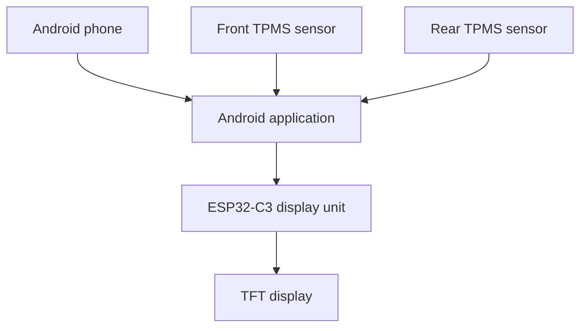

# Motorcycle Notification & TPMS Display

A compact motorcycle display system built around an ESP32-C3 and an Android application. It presents selected phone notifications, incoming-call information, phone battery status, and tire-pressure data on a handlebar-mounted TFT display.

The Android phone acts as the communication hub: it receives phone events and BLE TPMS data, filters and formats the relevant information, and forwards compact messages to the ESP32. The ESP32 handles parsing, warning logic, persistence, and display rendering.

> **Project status:** Active prototype. Phone-to-display BLE communication, notification rendering, and the embedded display foundation are implemented. TPMS integration and reliable background reconnection while the phone is locked are ongoing development areas.

## Features

### Implemented

- ESP32-C3 BLE peripheral named `MotoNotifyDisplay`
- Android-to-ESP32 BLE connection
- Display of selected phone notifications
- Incoming-call information
- Phone battery updates
- Compact custom text protocol
- TFT display rendering and idle screen
- Persistent configuration on the ESP32
- OTA firmware updates over Wi-Fi
- Tire-pressure warning states in the embedded display logic

### In Development

- Stable Android background operation through a foreground service
- Automatic reconnection when the ESP32 restarts while the phone is locked
- Simultaneous Android BLE connections to the ESP32 and both TPMS sensors
- Reliable pressure and temperature decoding for front and rear sensors
- Forwarding live TPMS data to the ESP32
- Android configuration UI for target pressures and warning thresholds
- Final weatherproof motorcycle enclosure and power installation

### Planned

- Per-app notification filters
- Multiple motorcycle profiles
- TPMS and temperature history
- External warning LEDs or audible alerts
- Navigation information
- Ride statistics

## System Overview



The phone handles Android permissions, notification access, calls, background execution, and BLE central connections. The ESP32 remains focused on receiving compact messages and presenting information clearly while riding.

See [ARCHITECTURE.md](ARCHITECTURE.md) for component responsibilities, BLE flows, message handling, reconnect behavior, and safety considerations.

## Hardware

| Component | Purpose |
|---|---|
| Seeed Studio ESP32-C3 SuperMini | BLE receiver and display controller |
| TFT display | Rider-facing interface |
| Front BLE TPMS sensor | Front pressure and temperature |
| Rear BLE TPMS sensor | Rear pressure and temperature |
| Android phone | Notification, call, TPMS, and BLE hub |
| Motorcycle power supply | Powers the embedded display unit |

## Technology

### Embedded Firmware

- C++
- Arduino framework
- PlatformIO
- NimBLE
- TFT_eSPI
- Persistent configuration storage
- Arduino OTA

### Android Application

- Kotlin
- Android BLE APIs
- `BluetoothGatt`
- `NotificationListenerService`
- Foreground-service architecture for reliable background communication
- Notification filtering and message formatting

### Communication

- Bluetooth Low Energy
- Custom text-based message protocol
- Android phone as BLE central
- ESP32-C3 as BLE peripheral

## BLE Message Protocol

The protocol uses short, human-readable messages. A prefix identifies the message type and the remaining text contains its value.

Examples:

```text
CALL:John Doe
NOTIFY:WhatsApp: Alex
BAT:58
FRONT:2.30
REAR:2.20
FTEMP:28
RTEMP:31
```

| Prefix | Meaning | Example value |
|---|---|---|
| `CALL` | Incoming call information | Caller name or number |
| `NOTIFY` | Selected notification | Application and message summary |
| `BAT` | Phone battery percentage | `58` |
| `FRONT` | Front tire pressure | `2.30` bar |
| `REAR` | Rear tire pressure | `2.20` bar |
| `FTEMP` | Front tire temperature | `28` °C |
| `RTEMP` | Rear tire temperature | `31` °C |

The text format is easy to inspect during development and simple to parse on the ESP32. A versioned binary protocol can be introduced later if message size or throughput becomes a real limitation.

## Tire-Pressure Warning Logic

Pressure warnings are calculated relative to configurable front and rear reference pressures.

Default reference values:

| Tire | Reference pressure |
|---|---:|
| Front | 2.5 bar |
| Rear | 2.8 bar |

| Status | Condition |
|---|---|
| Normal | Pressure is within the configured warning limits |
| Warning low | More than 10% below the reference pressure |
| Critical low | Front more than 15% low; rear more than 20% low |
| Warning high | More than 15% above the reference pressure |
| Critical high | More than 25% above the reference pressure |
| Critical | Pressure is less than or equal to 0 bar |

The display uses a simple color hierarchy:

| State | Color |
|---|---|
| Normal | White |
| Warning | Yellow |
| Critical | Red |

Reference pressures and thresholds must be configured for the motorcycle, tires, load, and manufacturer recommendations used in the real installation.

## Building the Firmware

1. Open the firmware project in Visual Studio Code with PlatformIO.
2. Select the configured ESP32-C3 environment.
3. Configure the display pins and TFT_eSPI setup for the installed hardware.
4. Build and upload the firmware over USB.
5. Configure Wi-Fi only if OTA updates are required.

After the first USB upload, later firmware versions can be installed through Arduino OTA when the device and development computer are on the same network.

## Building the Android Application

1. Open the Android project in Android Studio.
2. Grant the required Bluetooth and notification permissions.
3. Enable notification access for the application.
4. Build and install the application on the Android phone.
5. Connect the app to `MotoNotifyDisplay`.
6. Configure the front and rear TPMS sensors when TPMS support is enabled.

Android background restrictions vary between phone manufacturers. Foreground-service behavior, battery optimization, and BLE reconnection must be tested on the actual phone used on the motorcycle.

## Development Priorities

1. Finish the foreground service and locked-phone reconnection behavior.
2. Complete and verify both TPMS sensor connections.
3. Validate pressure and temperature values against known measurements.
4. Finish the Android configuration interface.
5. Improve display layouts and connection indicators.
6. Test reconnects, sensor loss, invalid values, and low battery conditions.
7. Build and validate the weatherproof motorcycle installation.

## Safety

This is a personal prototype and not a certified tire-pressure monitoring system. It should supplement, not replace:

- Manual pressure checks with a reliable gauge
- Motorcycle manufacturer pressure recommendations
- Regular tire inspection
- Approved motorcycle instruments and warning systems

The interface should not encourage interaction while riding. Alerts must be readable at a glance, and configuration should be performed while stationary.

## License

This project is licensed under the [MIT License](LICENSE)
