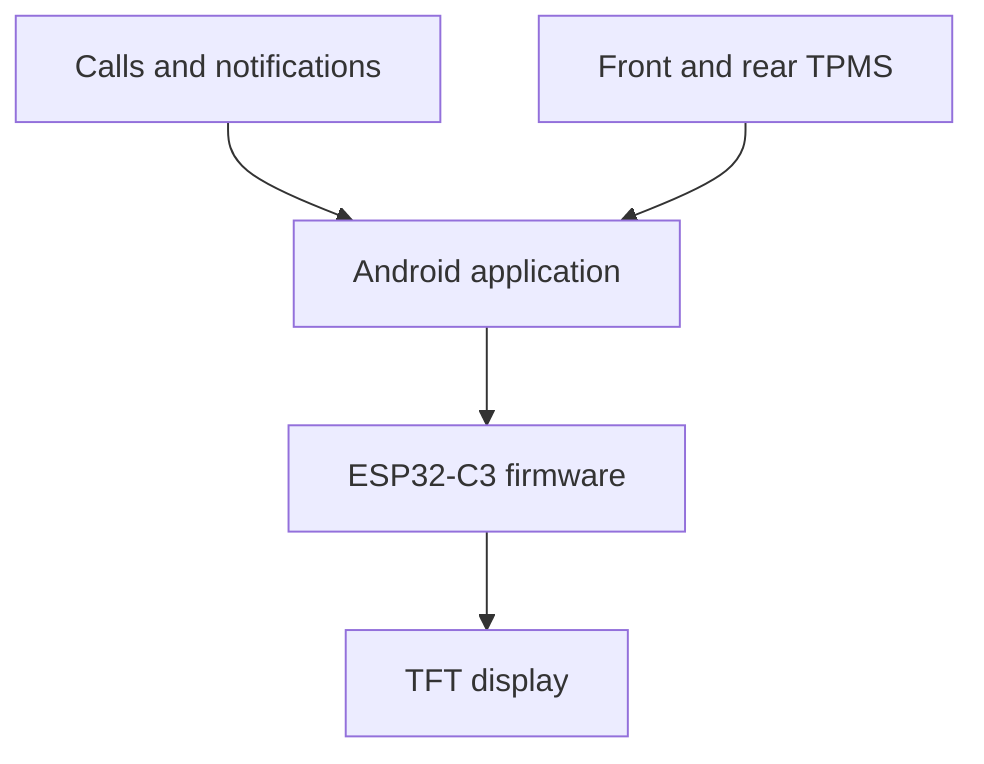
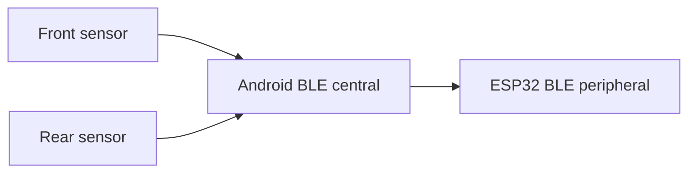
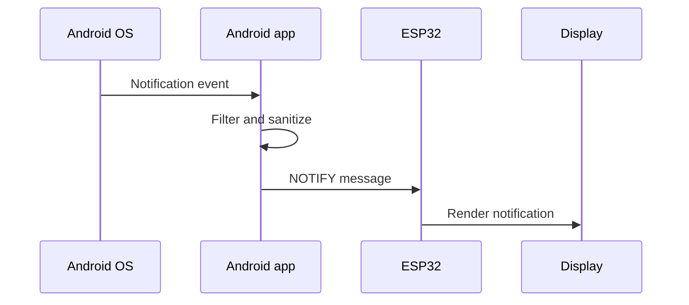
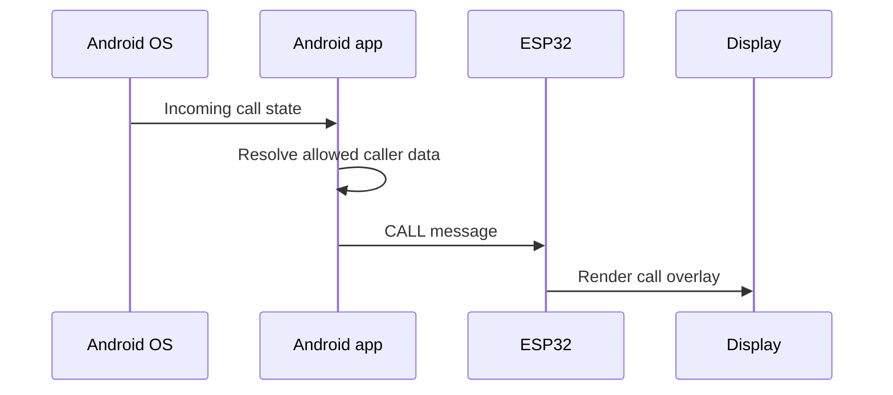
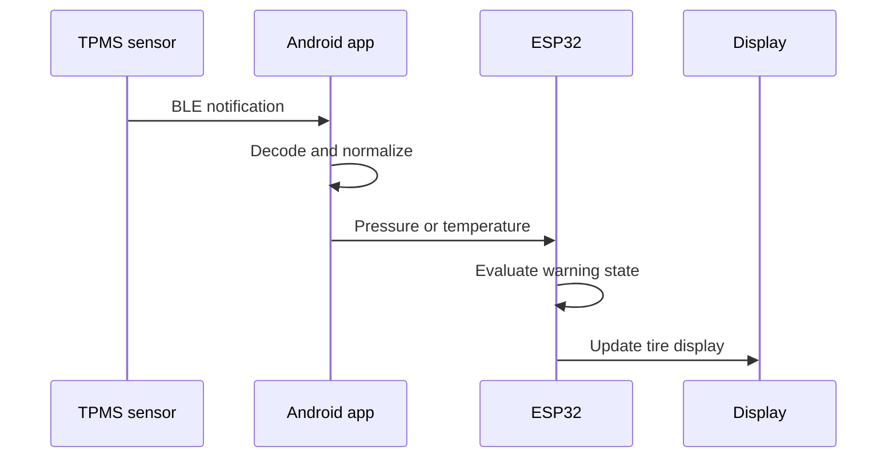
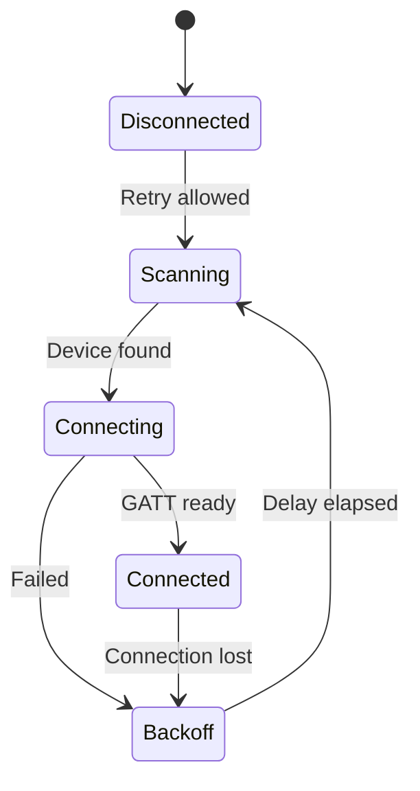

# Architecture

This document describes the architecture of the Motorcycle Notification & TPMS Display. It separates the working embedded foundation from background-reconnection and TPMS functionality that is still being completed.

## 1. Design Goals

- Present essential information without requiring the rider to handle the phone.
- Keep the handlebar unit small and computationally simple.
- Use the Android phone for operating-system events and BLE sensor management.
- Keep the communication protocol easy to debug.
- Continue displaying the latest valid data when one source temporarily disconnects.
- Make warning states clear without creating unnecessary distraction.
- Allow the system to recover from phone, display, or sensor restarts.

## 2. System Context



The Android app is the central bridge. It combines Android system events and two BLE sensor connections into one application-level stream sent to the ESP32.

The ESP32 does not connect directly to the TPMS sensors. This avoids requiring the embedded unit to act as both a BLE peripheral for the phone and a BLE central for multiple sensors while also updating the display.

## 3. Component Responsibilities

### 3.1 Android Application

The Android application is responsible for:

- Receiving selected notifications through `NotificationListenerService`
- Detecting and formatting incoming-call information
- Filtering private or irrelevant notification content
- Maintaining the BLE connection to the ESP32
- Scanning for and connecting to front and rear TPMS sensors
- Subscribing to TPMS characteristics
- Decoding pressure, temperature, status, and battery data where available
- Forwarding normalized data to the ESP32
- Managing background execution and reconnect behavior
- Providing configuration for reference pressures and enabled applications

The Android app acts as a BLE central for all connections.

### 3.2 ESP32-C3 Display Unit

The ESP32 firmware is responsible for:

- Advertising the `MotoNotifyDisplay` BLE service
- Accepting an Android BLE connection
- Receiving framed application messages
- Parsing message prefixes and values
- Updating phone, call, notification, and TPMS state
- Calculating warning levels from configured pressure limits
- Rendering the correct screen or overlay
- Storing configuration values persistently
- Handling connection loss without crashing or blocking the display loop
- Supporting firmware updates over USB or OTA

The ESP32 is the authoritative component for the final visual warning state because it must continue rendering even if the phone briefly stops sending updates.

### 3.3 TPMS Sensors

Each tire uses an independent BLE sensor. Depending on the sensor protocol, values may be exposed through notifications, indications, or manufacturer-specific data.

Expected sensor data includes:

- Tire pressure
- Tire temperature
- Sensor battery level
- Sensor identity
- Availability or stale-data state

Raw sensor packets must be decoded and converted to consistent units before they are forwarded to the ESP32.

### 3.4 TFT Display

The display presents:

- Connection state
- Incoming-call overlay
- Selected notification overlay
- Front and rear pressure
- Front and rear temperature
- Warning and critical colors
- Phone battery state where useful

Display updates should be non-blocking so BLE events and reconnect logic remain responsive.

## 4. BLE Topology



The Android device maintains three logical BLE relationships:

1. Android to ESP32 display unit
2. Android to front TPMS sensor
3. Android to rear TPMS sensor

Connections must be tracked independently. Losing one TPMS sensor must not disconnect the ESP32, and restarting the ESP32 must not unnecessarily discard valid TPMS sensor connections.

## 5. Data Flows

### 5.1 Notification Flow



The app should forward only explicitly enabled applications and the minimum information required for the display.

### 5.2 Call Flow



Caller information should be cleared when the call ends so stale data does not remain on screen.

### 5.3 TPMS Flow



The app converts sensor-specific packets into stable protocol messages. The ESP32 therefore does not depend on the details of a particular TPMS sensor model.

## 6. Application Protocol

The current protocol uses UTF-8 text messages with a type prefix and colon separator.

```text
TYPE:value
```

Examples:

```text
CALL:John Doe
NOTIFY:WhatsApp: Alex
BAT:58
FRONT:2.30
REAR:2.20
FTEMP:28
RTEMP:31
```

### Parsing Rules

1. Read one complete BLE message.
2. Split at the first colon.
3. Treat the first part as the message type.
4. Keep the remainder as the payload so notification text may contain additional colons.
5. Validate numeric payloads before updating stored state.
6. Ignore unknown message types without crashing.

Malformed data must not overwrite the most recent valid pressure value.

### Possible Future Versioning

If the protocol expands significantly, a version prefix can be added:

```text
V1:FRONT:2.30
```

Protocol versioning should only be introduced when compatibility between released Android and firmware versions becomes difficult to manage.

## 7. Warning-State Calculation

The ESP32 calculates the final visual status from pressure, configured reference values, and stale-data state.

Default references:

| Tire | Reference |
|---|---:|
| Front | 2.5 bar |
| Rear | 2.8 bar |

Percentage thresholds:

| Status | Front | Rear |
|---|---|---|
| Warning low | More than 10% below reference | More than 10% below reference |
| Critical low | More than 15% below reference | More than 20% below reference |
| Warning high | More than 15% above reference | More than 15% above reference |
| Critical high | More than 25% above reference | More than 25% above reference |

Values less than or equal to zero are treated as critical or invalid rather than normal pressure readings.

Recommended evaluation order:

```text
Invalid or <= 0
-> Critical low/high
-> Warning low/high
-> Normal
```

The warning algorithm should also distinguish a real measured value from missing or stale sensor data. A disconnected sensor must not silently appear as a valid zero-pressure measurement unless the protocol explicitly reports that value.

## 8. State and Persistence

### Android State

The app tracks:

- ESP32 connection and `BluetoothGatt`
- Front sensor identity and connection
- Rear sensor identity and connection
- Last decoded sensor values
- Enabled notification applications
- Desired reference pressures
- Foreground-service lifecycle

### ESP32 State

The firmware tracks:

- BLE connection state
- Current display mode
- Latest call or notification
- Phone battery value
- Front and rear pressure
- Front and rear temperature
- Last update time for every tire
- Configured reference pressures and warning limits
- Current warning state

Persistent configuration should include only settings. Rapidly changing live measurements should normally remain in memory to avoid unnecessary flash writes.

## 9. Background Operation and Reconnection

Reliable locked-phone operation requires the BLE lifecycle to be owned by a foreground service rather than only an activity.

Target reconnect behavior:



Important rules:

- Only one active connection attempt should exist per device.
- Close obsolete `BluetoothGatt` objects before reconnecting.
- Use increasing retry delays to avoid a rapid reconnect loop.
- Keep the service alive with a visible Android notification.
- Handle Bluetooth being disabled and re-enabled.
- Restore connections after the ESP32 reboots while the phone is locked.
- Treat the two TPMS sensors and ESP32 as independent connection state machines.

This area requires testing on the real phone because Android power management differs between manufacturers.

## 10. Display State Model

A useful display priority is:

```text
Critical TPMS warning
-> Incoming call
-> Important notification
-> TPMS overview
-> Idle screen
```

The exact priority must balance urgency and distraction. A critical tire warning should not be hidden indefinitely by an ordinary notification.

Temporary overlays should expire automatically and return to the previous persistent screen.

## 11. Failure Handling

The system should handle the following conditions explicitly:

- Android application not connected
- ESP32 restarted
- Front sensor unavailable
- Rear sensor unavailable
- Both sensors unavailable
- Stale pressure value
- Invalid or malformed BLE message
- Phone Bluetooth disabled
- Display initialization failure
- OTA update interrupted

A failure in one data source should not stop unrelated information. For example, a missing rear TPMS sensor should not prevent incoming calls from being displayed.

## 12. Privacy and Security

- Notification access is highly sensitive and should be limited to selected applications.
- Full message contents should be optional.
- Caller information should not be stored longer than required.
- BLE commands that modify configuration should be validated.
- OTA updates should only be enabled on trusted networks.
- Wi-Fi credentials must not be committed to the repository.
- Debug logs should avoid printing private notification or caller content in release builds.

## 13. Physical and Electrical Considerations

The motorcycle installation must account for:

- Input-voltage conversion and electrical transients
- Ignition-switched power
- Weatherproof connectors and enclosure
- Vibration resistance
- Display readability in sunlight
- Glove-friendly or no-touch operation
- Secure mounting
- Cable strain relief
- Heat and condensation

The software should start automatically when power is applied and recover cleanly from sudden power loss.

## 14. Future Evolution

Possible future capabilities include:

- Versioned configuration messages
- Multiple motorcycle profiles
- Historical TPMS data stored on the phone
- Navigation instruction forwarding
- Ride statistics
- External warning LED or buzzer
- Configurable display themes
- Sensor battery warnings

New functions should preserve the main architecture: Android manages platform events and BLE peripherals, while the ESP32 provides a deterministic rider-facing display.

## 15. Safety Boundary

The project is an experimental supplemental display, not an approved automotive safety system. Pressure warnings depend on sensor accuracy, BLE availability, correct decoding, configuration, and software operation.

The rider remains responsible for manual tire inspection, verified pressure measurements, and following the motorcycle and tire manufacturers' recommendations.
